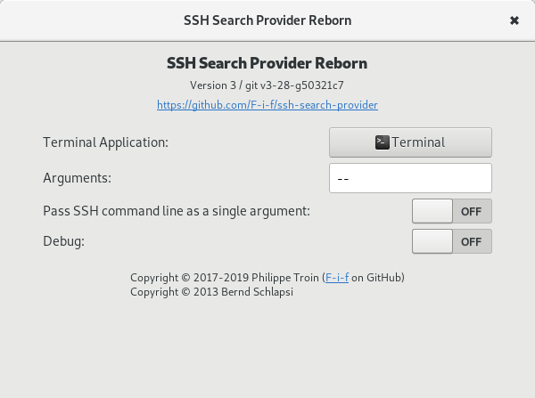

SSH Search Provider Reborn
===========================

A gnome-shell extension which searches the ssh config and known_hosts
file and provides the found ssh connections in your shell overview.

## This is a fork

This project is a fork of the
[gnome-shell-extension-sshsearch](https://github.com/brot/gnome-shell-extension-sshsearch)
project which has been unmaintained for a while.

## Features

 * It parses `~/.ssh/config`, `/etc/ssh/ssh_config` and
   `/etc/ssh_config` files (if they exist) and searches for host names.

 * It parses `~/.ssh/known_hosts`, `/etc/ssh/ssh_known_hosts` and
   `/etc/ssh_known_hosts` files (if they exist) and reads all host
   names (to use this feature you have to set the ssh setting
   "HashKnownHosts" to "no").

 * You can prepend a host name with a user name as in `user@host`.

## Configuration

SSH Search Provider Reborn comes with a preference panel which can be
found from the "Tweaks" application or the [Gnome Shell Extensions
page](https://extensions.gnome.org/local/).

The _Arguments_ and _Pass SSH command line as a single argument_
parameters are automatically filled if the picked _Terminal
Application_ is one of the following supported applications:

- Gnome Terminal (`org.gnome.Terminal.desktop`, the default)

- Guake (`guake.desktop`)

- RXVT (`rxvt.desktop`)

- Tilix (`com.gexperts.Tilix.desktop`)

- XTerm (`xterm.desktop`)

If the configured _Terminal Application_'s `.desktop` file cannot be
found, the extension falls back to using the
`org.gnome.desktop.applications.terminal.exec` and
`org.gnome.desktop.applications.terminal.exec-args` dconf keys.  You
can set them up as described in the [documentation for the extension
version
3](https://github.com/F-i-f/ssh-search-provider/blob/5a960aff1cc6b3f2ca79d8b7b0fd3bb2ea4e2612/README.md#selecting-your-preferred-terminal-application).

## Examples

Assume the ~/.ssh/config file looks like:

	Host desktop
	User user
	HostName 192.168.1.100

	Host desktop1
	User user
	HostName 192.168.1.101

	host vserver
	User user
	Port 2222
	HostName 11.11.111.111

and the ~/.ssh/known_hosts file looks like:

	[11.11.111.111]:2222 ssh-rsa AAAAB...
	github.com,207.97.227.239 ssh-rsa AAAAB...
	user.webfactional.com,22.22.222.222 ssh-rsa AAAAB...
	192.168.1.100 ssh-rsa AAAAB...

Here are some example searches and the search results:

 * search-term: **desk**
   1. desktop
   2. desktop1

 * search-term: **rv**
   1. vserver

 * search-term: **11**
   1. 11.11.111.111:2222

 * search-term: **97**
   1. 207.97.227.239

 * search-term: **user@** (all host names are in the search results)
   1. user@desktop
   2. user@desktop1
   3. user@vserver
   4. user@11.11.111.111:2222
   5. user@github.com
   6. user@207.97.227.239
   7. user@user.webfactional.com
   8. user@22.22.222.222
   9. user@192.168.1.100

 * search-term: **user@des**
   1. user@desktop
   2. user@desktop1

## License

SSH Search Provider Reborn is free software: you can redistribute it
and/or modify it under the terms of the GNU General Public License as
published by the Free Software Foundation, either version 3 of the
License, or (at your option) any later version.

This program is distributed in the hope that it will be useful, but
WITHOUT ANY WARRANTY; without even the implied warranty of
MERCHANTABILITY or FITNESS FOR A PARTICULAR PURPOSE.  See the GNU
General Public License for more details.

You should have received a copy of the GNU General Public License
along with this program.  If not, see [http://www.gnu.org/licenses/].

## Download / Install

Install directly from the [Gnome Shell Extensions
site](https://extensions.gnome.org/extension/1714/ssh-search-provider-reborn/).

Or download the zip file from the GitHub [releases
page](https://github.com/F-i-f/ssh-search-provider/releases) and unzip
[the
file](https://github.com/F-i-f/ssh-search-provider/releases/download/v7/ssh-search-provider@extensions.gnome-shell.fifi.org.v7.shell-extension.zip)
in the
`~/.local/share/gnome-shell/extensions/ssh-search-provider@extensions.gnome-shell.fifi.org`
directory (you may have to create the directory).

## Building from source

### Requirements

- [meson](http://mesonbuild.com/) v0.44.0 or later.

### Running the build

- Check out: `git clone https://github.com/F-i-f/ssh-search-provider`

- `cd ssh-search-provider`

- Run meson: `meson build`

- To install in your your gnome shell extensions' directory (~/.local/share/gnome-shell/extensions), run ninja: `ninja -C build install`

- To build the extension zip files, run: `ninja -C build extension.zip`, the extension will be found under `build/extension.zip`.

## Changelog

### Version 7
#### October 6, 2020

- Declare gnome-shell 3.38 compatibility (no code changes required).

### Version 6
#### March 11, 2020

- Declare gnome-shell 3.36 compatibility (no code changes required).
- Fix deprecation warning in preferences.
- Update meson-gse to latest.
- Now prints the gnome-shell version and the session type on start-up.

### Version 5
#### September 30, 2019.

- Declare compatibility with shell versions 3.33.90 and 3.34 (no code
  changes required).
- Added Travis CI support in build tree.
- Added license in README.md.

### Version 4
#### April 16, 2019.

This is a complete overhaul of the extension.

New features:

- Preference panel for configuring the preferred terminal application.

- Supports literal IPv6 hosts.

- Supports gnome-shell 3.28 (and potentially older versions) (GitHub
  Issue #3).

- Fully handle terminal emulators other than Gnome Terminal.  Sensible
  defaults are provided for: Gnome Terminal, Guake, RXVT, Tilix and
  XTerm, but any other terminal emulator can be used.

- Also parse and monitor `/etc/ssh_config` and `/etc/ssh/ssh_config`,
  if they exist.

- If the any of the ssh configuration files is a symbolic link, the
  link target is also monitored for changes.

- Added debug logging (configurable in preferences).

- Faster (sub-)search.

- Internationalized, french translation.

Changes:

- The results now appear under the "SSH" Gnome Shell overview heading
  (used to be the name of the terminal emulator application).

- `~/.ssh/known_hosts` (and related) entries containing ports (eg.
  `[localhost]:1234`) are now displayed (and can be searched) by using
  the bracketed syntax.  This allows for parsing ports in IPv6 literal
  addresses correctly.

- The Terminal Emulator arguments must be fully specified for Gnome
  Terminal (the extension used to silently inject the `--command`
  switch, not anymore).

- Use Subset search when applicable to speed-up searching.

- Almost complete under-the-hood re-implementation.

Bugs fixed:

- No more hidden dependencies on Gnome Terminal (GitHub Issue #2).

- Don't drop/recreate settings and settings signals when the terminal
  emulator application is changed.

- Ignore wildcards when parsing the `~/.ssh/config` (and related)
  files.

- Fix terminal emulator command line when launching an host of the
  form `user@host:port`.

- Don't allow completing `@host` (no user part).

- Don't give completions until at least one letter of the host name is
  entered (otherwise `user@` would display all possible hosts).

- Icons are now the same in the overview search heading and the
  individual search results.

- Avoid re-parsing the files needlessly (better filtering of
  Gio.file.monitor_file() events).

### Version 3
#### March 27, 2019.

- The host names read from `~/.ssh/config` are not coerced to lower-case.

### Version 2
#### March 26, 2019.

- ES6 / Gnome-Shell 3.32 compatibility (still compatible with 3.30 and
  lower).

- Updated meson-gse to latest.

- Minor doc updates.

### Version 1
#### March 24, 2019.

- First release, based upon [the
  original](https://github.com/brot/gnome-shell-extension-sshsearch).

## Credits

- The [`meson-gse` credits](https://github.com/F-i-f/meson-gse/) are
  included here by reference.

- Bernd Schlapsi <brot@gmx.info> for the original extension.

<!--  LocalWords:  config sshsearch unmaintained HashKnownHosts rsa
 -->
<!--  LocalWords:  HostName desktop1 vserver AAAAB github rv 'gnome
 -->
<!--  LocalWords:  terminal' gsettings arg args borderless Changelog
 -->
<!--  LocalWords:  extensions' Bernd Schlapsi Troin Fif dconf prepend
 -->
<!--  LocalWords:  ES6 gse Guake RXVT Tilix XTerm 's IPv6 eg
 -->
<!--  LocalWords:  wildcards merchantability
 -->
