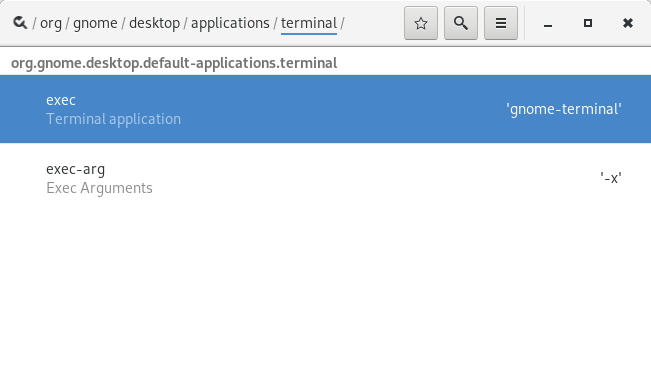

SSH Search Provider Reborn
===========================

A gnome-shell extension which searches the ssh config and known_hosts
file and provides the found ssh connections in your shell overview.

## This is a fork

This project is a fork of the
[gnome-shell-extension-sshsearch](https://github.com/brot/gnome-shell-extension-sshsearch)
project which has been unmaintained for a while.

## Features

 * it parses the ~/.ssh/config file and searches for the host names

 * it parses the ~/.ssh/known_hosts file and reads all host names (to
   use this feature you have to set the ssh setting "HashKnownHosts"
   to "no")

 * you are able to define a user for the founded hosts in the search
   term

## Examples

Assume the ~/.ssh/config file looks like:

	Host desktop
	User user
	HostName 192.168.1.100

	Host desktop1
	User user
	HostName 192.168.1.101

	host vserver
	User user
	Port 2222
	HostName 11.11.111.111

and the ~/.ssh/known_hosts file looks like:

	[11.11.111.111]:2222 ssh-rsa AAAAB...
	github.com,207.97.227.239 ssh-rsa AAAAB...
	user.webfactional.com,22.22.222.222 ssh-rsa AAAAB...
	192.168.1.100 ssh-rsa AAAAB...

Here are some example searches and the search results:

 * search-term: **desk**
   1. desktop
   2. desktop1

 * search-term: **rv**
   1. vserver

 * search-term: **11**
   1. 11.11.111.111:2222

 * search-term: **97**
   1. 207.97.227.239

 * search-term: **user@** (all host names are in the search results)
   1. user@desktop
   2. user@desktop1
   3. user@vserver
   4. user@11.11.111.111:2222
   5. user@github.com
   6. user@207.97.227.239
   7. user@user.webfactional.com
   8. user@22.22.222.222
   9. user@192.168.1.100

 * search-term: **user@des**
   1. user@desktop
   2. user@desktop1

## Download / Install

Install directly from the [Gnome Shell Extensions
site](https://extensions.gnome.org/extension/1714/ssh-search-provider-reborn/).

Or download the zip file from the GitHub [releases
page](https://github.com/F-i-f/ssh-search-provider/releases) and unzip
[the
file](https://github.com/F-i-f/ssh-search-provider/releases/download/v3/ssh-search-provider@extensions.gnome-shell.fifi.org.v3.shell-extension.zip)
in the
`~/.local/share/gnome-shell/extensions/ssh-search-provider@extensions.gnome-shell.fifi.org`
directory (you may have to create the directory).

## Selecting Your preferred Terminal Application

If you want to replace 'gnome-terminal' with the name of your
preferred terminal app so you have to set it with either *dconf
Editor* or with *gsettings*.

### Instructions for *dconf Editor*

Launch *dconf Editor* and navigate to the
`/org/gnome/desktop/applications/terminal/` key.

### Instructions with *gsettings*:

Enter the following command on the terminal:

	gsettings set org.gnome.desktop.applications.terminal exec <new default editor>

For example if you want to change *gnome-terminal* to *terminator* type:

	gsettings set orgf.gnome.desktop.applications.terminal exec terminator

#### Defining arguments for your Terminal Application

If you want to add some arguments to your terminal app command line
you can set them with:

	gsettings set org.gnome.desktop.applications.terminal exec-arg "<args>"

For example if you want to use *terminator* in border-less mode type:

	gsettings set org.gnome.desktop.applications.terminal exec-arg "--borderless"

## Building from source

### Requirements

- [meson](http://mesonbuild.com/) v0.44.0 or later.

### Running the build

- Check out: `git clone https://github.com/F-i-f/ssh-search-provider`

- `cd ssh-search-provider`

- Run meson: `meson build`

- To install in your your gnome shell extensions' directory (~/.local/share/gnome-shell/extensions), run ninja: `ninja -C build install`

- To build the extension zip files, run: `ninja -C build extension.zip`, the extension will be found under `build/extension.zip`.

## Changelog

### Version 3
#### March 27, 2019.

- The host names read from `~/.ssh/config` are not coerced to lower-case.

### Version 2
#### March 26, 2019.

- ES60 / Gnome-Shell 3.32 compatibility (still compatible with 3.30 and lower).
- Updated meson-gse to latest.
- Minor doc updates.

### Version 1
#### March 24, 2019.

- First release, based upon [the
  original](https://github.com/brot/gnome-shell-extension-sshsearch).

## Credits

- The [`meson-gse` credits](https://github.com/F-i-f/meson-gse/) are
  included here by reference.

- Bernd Schlapsi <brot@gmx.info> for the original extension.

<!--  LocalWords:  config sshsearch unmaintained HashKnownHosts rsa
 -->
<!--  LocalWords:  HostName desktop1 vserver AAAAB github rv 'gnome
 -->
<!--  LocalWords:  terminal' gsettings arg args borderless Changelog
 -->
<!--  LocalWords:  extensions' Bernd Schlapsi Troin Fif dconf
 -->
